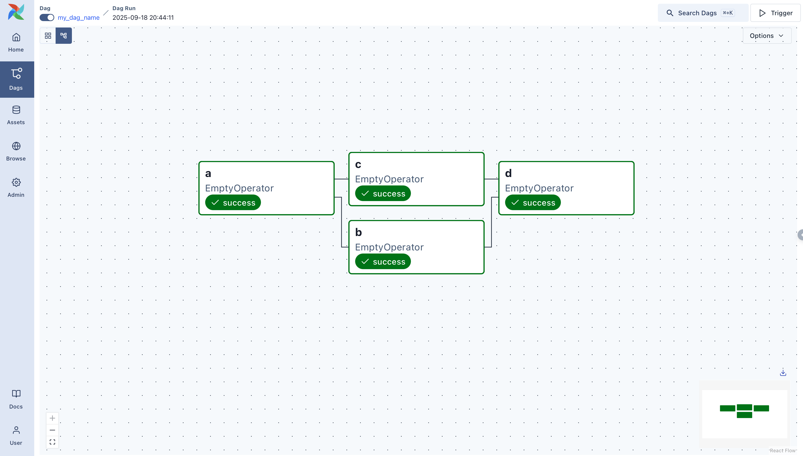

# Data Engineering: Pipeline Orchestration with Apache Airflow

## 1. Why Orchestrate? Getting to Know Airflow

### 1.1. Presentation

#### Instructor Presentation
* **Instructor:** Oscar Meyer (Solutions Architect at Datasight).
* **Experience:** Over 10 years of career in data (previous experience as a DBA, data engineering, and solutions architecture). Specialist focused on AWS (*AWS Data Analytics Specialty* certification).
* **Professional Context:** Working as a consultant helping clients transform businesses with data and AI, dealing with data architectures, agent-based systems, and modern Big Data ecosystems.

#### Course Objectives
* Convey practical and conceptual knowledge on using Apache Airflow in daily workflows.
* Follow a structured line of reasoning: from **foundations** to **execution in a practical project**.

#### Course Structure and Focus
1. **Understanding the Problem:** Comprehend what problem Airflow solves, its usefulness, proper usage, and comparison with other tools on the market.
2. **Ecosystem Exploration:** Capture essential Airflow concepts before starting practical work.
3. **Practical Project and Execution:**
   * Setting up the Airflow environment.
   * Writing DAGs in Python using operators.
   * Tracking executions, configuration, testing, and managing credentials.
   * Optimizations after the first version of the DAG.

#### Teaching Approach and Use of AI
* **Conceptual Focus:** The priority is not just manual code writing, but a deep understanding of the concepts, functioning, and application of the tool.
* **Use of Generative AI:** Leveraging AI as a co-pilot to collaborate on code writing and support development, allowing for natural testing and validation.

### 1.2. The Problem of Loose Scripts and Cron

#### **The Role of an Orchestrator**
* **Definition:** An orchestrator manages tasks, determines execution flow, controls processes, and handles logs.
* **Main Objective:** Resolves problems in data pipelines by ensuring that the beginning, middle, and end occur in the correct order with appropriate logging.

#### **Problems of the Traditional Model (Loose Scripts and Cron)**
* **Implicit dependencies:** Main scripts that call multiple sub-scripts lack internal visibility; a failure in the main script cascades to others, and issues become difficult to track.
* **Lack of visibility and control:** Running everything at once through a single monolithic script makes tracking and error handling cumbersome.
* **Scheduling rigidity:** Changing specific execution times (such as moving a script to run at 3 AM instead of midday) requires manual refactoring and creating separate Cron setups.
* **Heavy manual labor:** Performing manual retries and managing scattered logs without a dedicated tool demands massive operational overhead.

#### **Advantages of Using Airflow**
* **Centralized visibility:** A visual interface to manage tasks individually, monitor states, and centralize logs.
* **Use of Native Operators:** Abstracts integrations with external tools and APIs (such as Databricks), removing the need to write custom authentication and connection scripts.
* **Ecosystem Features:** Creation of DAGs, separate schedules, explicit dependency declarations, automated error notifications, and native log centralization.

### 1.3. What is Airflow and When to Use It

#### **What is Apache Airflow**
* **Definition:** An open-source platform maintained by the Apache Software Foundation, designed to create, schedule, and monitor workflows.
* **Creation and Scheduling:** Involves using operators to ease work, writing dynamic DAGs (Directed Acyclic Graphs) in Python, and scheduling by time or events.
* **Monitoring and Observability:** Groups the entire data ecosystem into a centralized tool, allowing end-to-end flow tracking.

#### **Core Features**
* **Python Language:** Everything is built essentially in Python, bringing versatility to orchestration.
* **Web Interface:** Allows pausing DAGs, viewing states, analyzing execution charts per task, checking queues, and consulting centralized logs with user management.
* **Robust Ecosystem:** Relies on a strong community that continuously maintains and improves the tool.

#### **When to Use Airflow**
* **Application Scenarios:** Indicated for ETL processes, real-time (RT) flows, batch data, automations with inter-step dependencies, retries, alerts, and execution histories.
* **Service Decoupling:** Ideal for fragmented environments with various separate tools (ingestion, processing, visualization), unifying operational visibility.

#### **What Airflow Is NOT**
* **Processing Engine:** Airflow does not process data directly (the role of tools like Spark or Pandas); its function is to orchestrate, call executions, manage dependencies, administer logs, and schedule tasks.
* **Direct Ingestion:** Although it manages the flow, the actual processing of ingestion is done by scripts calling APIs, rather than by internal distributed processing capabilities of Airflow.

### 1.4. Core Airflow Concepts

#### **DAG (Directed Acyclic Graph)**
* **Definition:** A set of tasks with a defined direction, no cycles, and a visual representation, serving as a pipeline or workflow in Airflow.
* **Characteristics:** 
  * **Directed:** Possesses a continuous flow with a beginning, middle, and end, following a determined direction that can include logical branching.
  * **Acyclic:** Does not return to a previous state, avoiding infinite loops.
  * **Graph:** Provides a visual tree-like structure to understand dependencies and connected elements.

#### **Operators, Tasks, and Task Instances**
* **Operator:** A template or reference model that abstracts manual steps and API communications (e.g., generic, Python, Databricks, or AWS operators).
* **Task:** The implementation resulting from instantiating an operator and assigning it a specific function within a script.
* **Task Instance:** The specific execution of a task on a given date or time, providing telemetry such as state, logs, and execution duration.

#### **Scheduler and Executor**
* **Scheduler:** The service responsible for reading DAGs and determining what and when tasks should run based on defined schedules.
* **Executor:** The mechanism that handles direct execution, managing whether tasks run locally, queue up due to parallel limits, or run inside containers.

### 1.5. Graph no Airflow

#### **A Profundidade do Conceito**
* **Definição:** O termo *Graph* vai além de uma mera representação visual, refletindo a conectividade entre as tarefas de uma DAG para formar um diagrama de dependências e ordem de execução[cite: 1].
* **Importância:** É crucial para compreender a orquestração de fluxos de dados, permitindo identificar bifurcações, junções e sequências lineares[cite: 1].

#### **Funcionalidade e Visualização**
* **Elementos visuais:** O *graph* permite visualizar rapidamente a estrutura hierárquica, os pontos de decisão e as relações de dependência entre as tarefas[cite: 1].
* **Utilidade prática:** Esse nível de visualização é fundamental para o *debug*, monitoramento, otimização e identificação de gargalos em *workflows* complexos[cite: 1].

#### **Abordagens de Visualização**
* **Visualização Estática:** Ideal para uma visão geral rápida; simples de ler, mas não reflete mudanças dinâmicas em tempo real[cite: 1].
* **Visualização Interativa:** Permite interagir com o diagrama, expandir detalhes e aceder a logs e tempos de execução ao clicar em cada nó[cite: 1].
* **Mapeamento por Camadas:** Organiza *workflows* complexos agrupando tarefas por funcionalidade para tornar o entendimento mais intuitivo[cite: 1].