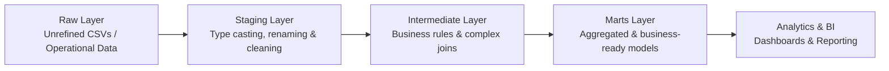

# Data Engineering: dbt - Modern Data Transformations

## 1. Introduction and Environment Setup

### 1.1. What is dbt and where does it fit?

**a) Concept and Purpose of dbt**
* **What dbt stands for:** *Data Build Tool*.
* **Main goal:** Transform data within the modern Analytics Engineering ecosystem using SQL.

**b) Where dbt fits in the data pipeline (The "T" in ELT)**
* **What dbt DOES NOT do:**
  * It does not perform data ingestion or extraction (e.g., fetching from APIs, reading files directly).
  * It does not load raw data into the database/warehouse.
* **What dbt DOES:**
  * Operates exclusively **after** data has been loaded into the database.
  * Transforms, organizes, standardizes, and prepares raw data for analysis and consumption.

**c) How dbt Works in Practice**
* **SQL Models:** Transformations are written as SQL queries and organized into models within the project.
* **In-database Execution:** dbt does not process data in its own memory. It pushes SQL queries to leverage the processing power of the Data Warehouse / Database itself.
* **Output:** Automatically creates curated `tables` or `views` directly inside the database.
* **Key Advantages:** High scalability and performance by utilizing native database processing capabilities.

**d) Hands-on Course Project**
* **Scenario:** Real-world e-commerce dataset containing inconsistencies, duplicates, and lack of standardization.
* **Project Deliverables:**
  * Cleaning and handling raw data issues.
  * Building structured, layered analytical models.
  * Implementing automated data quality tests.
  * Generating comprehensive project documentation.
  * Building an end-to-end data transformation pipeline.

### 1.2. Case Study Overview

**a) Business Context**
* **Scenario:** E-commerce company selling products online with existing customer, order, and product records.
* **Core Problem:** Operational systems generate raw data that is unorganized and not prepared for analytical querying or decision-making.
* **Engineering Scope:** Focus strictly on transforming existing database records into reliable analytical models (excluding ingestion/extraction).

**b) Dataset Overview and Data Quality Issues**
* **Target Entities:**
  * Customers (basic profiles: names, emails).
  * Orders (transaction records per customer).
  * Order Items (granular products purchased within each order).
  * Products (item catalog details).
* **Identified Data Quality Problems:**
  * Null or duplicate email addresses.
  * Inconsistent date formatting across tables.
  * Numerical prices incorrectly stored as text string types.
  * Invalid or null values.
  * Fully duplicate records.
  * Orphaned records (e.g., orders lacking associated customer IDs or nonexistent products).

**c) Transformation Strategy with dbt**
* **Layered Architecture Approach:**
  1. Cleaning and standardizing raw inputs.
  2. Integrating and enriching business rules across models.
  3. Building final, production-ready analytical tables for BI and dashboards.
* **Next Steps:** Setting up the local development environment and installing necessary tooling.

### 1.3. Creating the Raw Layer

**a) Concept of the Raw Layer**
* **Definition:** The entry point of the pipeline holding unrefined, unprocessed data as delivered by source operational systems.
* **Characteristics:** Contains native flaws, duplicates, null values, and inconsistent formatting without pre-cleansing.
* **Purpose:** Serves as the immutable source of truth that dbt will transform into reliable analytical datasets.

**b) Database Setup and Local Working Directory**
* **Database Creation:** Configured a PostgreSQL database named `dbt_curso` via pgAdmin.
* **Directory Structure:** Created a local project root (`/dbt`) containing three primary working subfolders:
  * `/dados` (Raw source CSV files: `clientes.csv`, `produtos.csv`, `pedidos.csv`, `itens_pedido.csv`).
  * `/esquemas` (Schema definitions).
  * `/SQL` (DDL and DML scripts).

**c) Schema Definition and Execution**
* Executed script `01_criar_tabelas_raw.sql` to instantiate the target `raw` schema and source tables (`clientes`, `produtos`, `pedidos`, `itens_pedido`).

**d) Data Loading**
* Executed script `02_carregar_csv_raw.sql` using PostgreSQL's native `COPY` command to populate the tables with raw data from the CSV files.

**e) Initial Data Exploration & Verification**
* Verified data ingestion by executing basic `SELECT` queries on `raw.clientes` and `raw.pedidos`.
* **Observed anomalies in ingested data:**
  * Null email addresses in `raw.clientes`.
  * Duplicate records in `raw.clientes`.
  * Non-standardized date formats stored as string types across multiple tables (`data_cadastro`, `data_pedido`, `data_validade`).

**f) Next Steps**
* Initialize the dbt project and configure database connection credentials.

### 1.4. Environment Setup

**a) Software & Tooling Requirements**
* **Python (v3.11.9):** Downloaded 64-bit Windows installer from the official site (`python.org`).
  * **Critical Step:** Enabled *Add python.exe to PATH* during setup.
  * **Verification Commands:**
    * Check Python: `python --version`
    * Check pip: `python -m pip --version`
    * Upgrade pip: `python -m pip install --upgrade pip`

* **Visual Studio Code (VS Code):** Installed as the primary IDE (`code.visualstudio.com`).
  * **Configuration:** Configured to always *Run as Administrator*.
  * **Extensions:** Installed the official **Python** extension.

* **PostgreSQL & pgAdmin 4:** Database engine and graphical management tool.
  * Installed default components (Database Server, pgAdmin 4, Command Line Tools).
  * Default Port: `5432`
  * Configured superuser (`postgres`) credentials and verified connection via `localhost` inside pgAdmin 4.

* **dbt Core & Postgres Adapter:** Transformation framework and PostgreSQL connector.
  * **Installation Command:** `python -m pip install dbt-core dbt-postgres`
  * **Verification Command:** `dbt --version` (verifies both core package and active Postgres adapter plugin).

**b) Next Steps**
* Initialize the dbt workspace and connect it to the target PostgreSQL database.

## 2. Analytics Engineering: dbt Core Project Initialization

### 2.1. Initializing the Project

**a) Project Setup and Directory Initialization**
* **Project Purpose:** Centralized repository for organizing SQL transformations, automated data testing, documentation, and DAG pipeline structures.
* **Initialization Command:** Ran `dbt init dbt_curso` inside the local workspace to generate project scaffold files.

**b) Interactive Profile Configuration (`profiles.yml`)**
* Configured the target adapter and connection parameters during the setup wizard:
  * **Database Adapter:** `postgres` (Selected option 1).
  * **Host:** `localhost`
  * **Port:** `5432`
  * **User:** `postgres`
  * **Password:** Configured target superuser password.
  * **Database Name:** `dbt_curso`
  * **Target Schema:** `public` (Kept separate from `raw` schema to preserve immutable source data).
  * **Threads:** `1` (Controls concurrent model execution).

**c) Generated Project Directory Scaffold**
* **`models/`:** Core folder containing SQL transformation models, directory layers, and YAML schema definitions.
* **`macros/`:** Reusable Jinja code blocks and custom functions.
* **`seeds/`:** Static CSV files loaded directly into the database.
* **`snapshots/`:** Type-2 Slowly Changing Dimension (SCD) historical tracking configurations.
* **`tests/`:** Custom assertion tests for data quality validation.
* **`dbt_project.yml`:** Root configuration file defining project metadata, variables, and model execution paths.

**d) Architectural Layering Strategy (Target Structure for `models/`)**
* `staging/`: Initial cleansing, casting, and renaming of source tables.
* `intermediate/`: Complex business logic joins and transformations.
* `marts/`: Business-ready, production-grade dimensional models and analytical data marts.

**e) Next Steps**
* Explore the created environment and configure the initial staging models.

### Key Concept: Multi-Layer Database Architecture

* **Layered Schema Separation:** Organizes data processing into distinct logical schemas to optimize maintainability, lineage tracking, and analysis.
  * **`Raw` Schema:** Stores unrefined, immutable source data exactly as ingested.
  * **`Staging` Schema:** Applies initial transformations (casting data types, renaming columns, removing basic inconsistencies, and light filtering).
  * **`Mart` / `Marts` Schema:** Houses fully transformed, aggregated, and business-ready datasets modeled for reporting, dashboards, and analytical queries.
* **Core Benefit:** Enables efficient data governance, isolates raw data errors from business logic, and optimizes end-user query performance for reporting and decision-making.

#### End-to-End Data Flow Pipeline



### 2.2. Database Connection and Verification (`profiles.yml` & `dbt debug`)

**a) Profile Configuration Separation**
* **Security & Multi-Environment Isolation:** Database credentials and connection parameters are stored outside the project repository in `~/.dbt/profiles.yml` (e.g., `C:\Users\<user>\.dbt\profiles.yml` on Windows) to prevent sensitive credentials from being committed to version control.
* **Target Profile Mapping:** Maps connection profiles (`dbt_curso`) to environment targets (e.g., `dev`, `prod`), specifying credentials (`host`, `user`, `pass`, `dbname`, `schema`, `threads`).

**b) Terminal Execution Context Rule**
* **Root Directory Constraint:** All dbt CLI operations must be executed directly within the dbt project root containing `dbt_project.yml` (`cd dbt_curso`). Running commands outside this directory results in `dbt_project.yml not found` errors.

**c) Environment Validation Protocol (`dbt debug`)**
* **Verification Scope:** Evaluates profile YAML syntax, project YAML loading, system dependencies (Git, Python), network reachability, and database target authentication.
* **Troubleshooting Common Setup Errors:**
  * Unreachable database host or inactive PostgreSQL service instance.
  * Authentication failures (user/password mismatch) or encoding issues under Windows environments.
  * Target database or target schema non-existence.
  * Incorrect directory scope during CLI execution.

### 2.3. Creating the First dbt Model (`dbt run`)

**a) Core Concepts of dbt Models**
* **SQL-Based Modeling:** Every model in dbt is defined as a `.sql` file containing a single `SELECT` statement. No procedural code or boilerplate DDL/DML (`CREATE TABLE`, `INSERT`) is required.
* **1:1 Mapping:** Each `.sql` file corresponds directly to one materialized database object (Table or View) inside the target schema (`public`).
* **Default Materialization:** By default, dbt builds models as SQL Views in PostgreSQL unless specified otherwise in configuration files.

**b) Model Creation & Direct SQL Reference**
* Created `models/clientes.sql` with a direct `SELECT` query referencing the ingested raw layer: `SELECT * FROM raw.clientes;`
* **Execution Boundary:** Serves as a baseline test model to verify object creation mechanics before applying analytical transformations and cleaning.

**c) Model Orchestration (`dbt run`)**
* **Execution Command:** Running `dbt run` compiles all `.sql` files in the `models/` directory into dynamic DDL statements and executes them inside the target database.
* **Build Artifacts Created:**
  * `public.clientes` (View)
  * `public.my_first_dbt_model` (Table - from dbt default scaffold)
  * `public.my_second_dbt_model` (View - from dbt default scaffold)

**d) Database Verification**
* Confirmed that `public.clientes` queries mirror the underlying `raw.clientes` source schema through `SELECT * FROM public.clientes;`.

### 2.4. Materialization Strategies in dbt (`table` vs `view`)

**a) Default Materialization Mechanics**
* **View Materialization (Default):** dbt defaults to building models as SQL Views in PostgreSQL. 
  * **Pros:** Lightweight, zero disk storage consumption, dynamic execution reflecting immediate underlying source updates.
  * **Cons:** Higher query latency on complex, multi-layered JOINs or heavy aggregations.

**b) Explicit Table Materialization (`config`)**
* Overrode default view materialization using Jinja config blocks at the model file header:
  `{{ config(materialized='table') }}`
* **Execution Outcome:** Running `dbt run` drops the existing `public.clientes` View and replaces it with a physical PostgreSQL Table storing materialized records on disk.

**c) Performance & Architectural Guidelines**
* **`Staging` / Preparation Layers:** Use **Views** (`materialized='view'`) for lightweight, intermediate schema casting and light cleaning to maximize build speed and preserve agility.
* **`Marts` / Consumption Layers:** Use **Tables** (`materialized='table'`) for aggregated, business-ready models to optimize query response times and read performance for BI tools and end users.

**d) Comparison Summary**
* **View:** Zero storage | Slower read on complex queries | Always up to date.
* **Table:** Disk storage required | Faster read on analytical queries | Requires `dbt run` execution to refresh snapshot data.

## 3. Staging Layer: Data Cleaning and Standardization

### 3.1. Introduction to the Staging Layer (`stg_`)

**a) Role and Position in Pipeline**
* **First Transformation Level:** Positioned directly between the immutable `raw` source layer and downstream modeling layers (`intermediate` / `marts`).
* **Purpose:** Cleans, formats, and standardizes raw data without altering granular entity definitions or destroying original row-level context.

**b) Multi-Layer Data Flow Architecture**
* **`Raw` Layer:** Unrefined, raw operational datasets (e.g., duplicate records, inconsistent date formats, missing emails).
* **`Staging` Layer:** Cleaned and standardized mirror of raw tables (1:1 mapping to source entities with clean data types and renamed fields).
* **`Intermediate` Layer:** Complex joins, business logic applications, and structural unnesting.
* **`Marts` Layer:** Aggregated, business-ready dimensional and fact tables for BI and analytics consumption.

**c) Staging Best Practices & Constraints**
* **No Aggregations:** Never perform `GROUP BY` or summarize metrics in staging models.
* **No Complex Business Rules:** Avoid applying domain-specific logic or multi-table joins.
* **Focus Areas:** Type casting, field renaming, null handling, deduplication, and syntax standardization.

### 3.2. Cleaning the Customers Table (`stg_clientes.sql`)

**a) Environment Cleanup & Project Standardization**
* **Removing Default Boilerplate:** Deleted scaffolded models (`models/example/`) and initial test files (`models/clientes.sql`). Dropped non-relevant database objects (`public.clientes`, `public.my_first_dbt_model`, `public.my_second_dbt_model`) via PostgreSQL CLI/GUI using `DROP CASCADE`.
* **Directory Scaffolding:** Created the dedicated `models/staging/` directory to house raw-to-staging transformations.
* **Naming Conventions:** Enforced the `stg_<entity_plural>` naming standard by creating `models/staging/stg_clientes.sql`.

**b) Cleaning & Normalization Rules Applied**
* **Whitespace Trimming:** Applied `TRIM()` to string columns (`nome_completo`, `cidade`, `estado`, `email`) to purge leading/trailing spaces.
* **String Case Standardization:** Converted all email strings to lowercase via `LOWER()` and state abbreviations to uppercase using `UPPER()`.
* **Null Value Handling:** Handled empty strings (`''`) within `email` by remapping them explicitly to SQL `NULL` values.
* **Data Type Casting:** Standardized raw text dates to proper SQL dates using `CAST(data_cadastro AS DATE)`.
* **Quality Flag Creation:** Added a boolean flag column (`fl_email_nulo`) to mark records with missing or empty emails (`1` for missing, `0` for valid) for downstream auditing.

**c) Execution & Verification (`dbt run`)**
* Executed `dbt run` within the project root directory.
* Confirmed the successful build of `public.stg_clientes` as a SQL View in PostgreSQL containing standardized, cleaned row-level data.

### 3.3. Cleaning the Products Table (`stg_produtos.sql`)

**a) Data Quality Issues Identified (`raw.produtos`)**
* **String Contaminants in Numeric Fields:** `preco_unitario` stored as text containing currency symbols (`R$`), leading/trailing whitespaces, and unhandled `NULL` values.
* **Inconsistent Categorical Text:** `categoria` mixed casing and outer whitespaces.
* **Unstandardized Boolean Formats:** `ativo` stored heterogeneous string variations representing truthy/falsy values (`true`, `false`, `sim`, `nao`, `s`, `n`, `1`, `0`).

**b) Cleaning & Normalization Strategies Applied**
* **Currency Symbol & Text Stripping:** Chained `LOWER()`, `TRIM()`, and `REPLACE()` functions to strip `r$` prefixes before casting string values to `NUMERIC`.
* **CTE Modularization & Null Remapping:** Wrapped initial parsing into a CTE (`select_produtos`) and applied `CASE WHEN preco_unitario IS NULL THEN 0` in the outer query to eliminate missing price values safely.
* **Boolean Normalization:** Standardized mixed textual representations into strict SQL Booleans (`TRUE`/`FALSE`) using `CASE WHEN LOWER(TRIM(ativo)) IN (...)`.
* **String Case Uniformity:** Enforced lowercased and trimmed strings on `categoria` and trimmed product names.

**c) Execution & Database Validation (`dbt run`)**
* Created `models/staging/stg_produtos.sql` and ran `dbt run` in VS Code terminal.
* Verified object creation as `public.stg_produtos` View via PostgreSQL query `SELECT * FROM public.stg_produtos;`.

### 3.4. Cleaning the Orders Table (`stg_pedidos.sql`)

**a) Inconsistencies & Quality Issues Identified (`raw.pedidos`)**
* **Unstandardized String Dates:** `data_pedido` stored as plain text with heterogeneous date formats (`YYYY-MM-DD`, `DD-MM-YYYY`), varying delimiters (`/`, `-`), and unhandled missing records.
* **Categorical String Variations:** `status` contained mixed case strings (`complete` vs `Complete`), plural/singular spelling differences (`canceled` vs `cancelled`), and blank/null entries.
* **Payment Method Formatting:** `forma_pagamento` included inconsistent formatting (`Credit Card` vs `credit_card`), space-delimited text, and missing values.

**b) Cleaning & Normalization Strategies Applied**
* **Regex Parsing & Delimiter Unification:** Utilized PostgreSQL Regex matching (`~`) to catch date structure patterns (`^\d{4}[-/]\d{2}[-/]\d{2}$` and `^\d{2}[-/]\d{2}[-/]\d{4}$`). Unified `/` delimiters to `-` using `REPLACE()` prior to calling `TO_DATE()`.
* **Sentinel Date Assignment (`COALESCE`):** Handled unparseable or missing date values by defaulting to a standard sentinel date (`1900-01-01`).
* **Categorical Normalization:** Mapped string variations to standard enums (`canceled`, `completed`, `credit_card`) using `LOWER()`, `TRIM()`, and `IN (...)` conditions. Assigned `'undefined'` to null or empty string fields.
* **dbt Syntax Constraints:** Omitted trailing SQL semicolons (`;`) in `.sql` model files to avoid Jinja compilation syntax errors.

**c) Execution & Verification (`dbt run -s stg_pedidos`)**
* Target execution using model selector (`-s stg_pedidos`).
* Confirmed the successful build of `public.stg_pedidos` View in PostgreSQL with normalized dates and clean categorical mappings.

### 3.5. Cleaning the Order Items Table (`stg_itens_pedido.sql`)

**a) Data Quality Issues Identified (`raw.itens_pedido`)**
* **Invalid & Non-Positive Quantities:** `quantidade` contained zero (`0`) and negative (`-1`) values representing invalid transaction records.
* **Numeric Fields Stored as Contaminated Text:** Both `preco_unitario` and `desconto` contained text characters, symbols, and irregular separators, preventing direct casting to numeric types.
* **Unhandled Nulls & Free Unit Prices:** `preco_unitario` contained missing values and zero-priced items (`0`), which are invalid for sales records.

**b) Cleaning & Normalization Strategies Applied**
* **Regex Sanitation & Numeric Casting:** Applied `REGEXP_REPLACE(field, '[^0-9.]', '', 'g')` to strip all non-numeric characters except decimal points, then cast the resulting text to `NUMERIC`.
* **Null Fallbacks (`COALESCE`):** Wrapped unit prices and discounts with `COALESCE(..., 0)` to default missing values to `0`.
* **Quantity Normalization:** Remapped negative or zero quantities (`quantidade <= 0`) to `0` using conditional `CASE` logic.
* **CTE Scaffolding for Safe Flag Creation:** Structured transformations using a Common Table Expression (`select_itens_pedido`) to execute type casting *before* evaluating boolean flags (`fl_quantidade_invalida`, `fl_preco_unitario_nulo`) in the outer query, avoiding type-mismatch compilation errors.
* **dbt Source Reference (`{{ source(...) }}`):** Replaced hardcoded schema table references (`raw.itens_pedido`) with Jinja source macros (`{{ source('dbt_curso', 'itens_pedido') }}`).

**c) Execution & Verification (`dbt run -s stg_itens_pedido`)**
* Executed the isolated model build using `dbt run -s stg_itens_pedido`.
* Confirmed the successful creation of `public.stg_itens_pedido` View in PostgreSQL, verifying clean numeric types, zero-defaulted nulls, and active quality flags via `SELECT * FROM public.stg_itens_pedido;`.

### 3.6. Productivity Tip: Dynamic Column Name Extraction

**a) Accelerating Model Scaffold Creation**
* **Context:** Instead of manually typing or copy-pasting column names from heavy raw tables into new dbt staging models, SQL system catalog queries can be used to generate a pre-formatted, comma-separated column list.

**b) PostgreSQL Information Schema Query**

```sql
SELECT string_agg(column_name, ', ') AS colunas
FROM information_schema.columns 
WHERE table_schema = 'raw' 
  AND LOWER(table_name) = 'itens_pedido';
```

* **Utility:** Produces a single string containing all attribute names formatted directly for instant pasting into `SELECT` statements within `.sql` files.